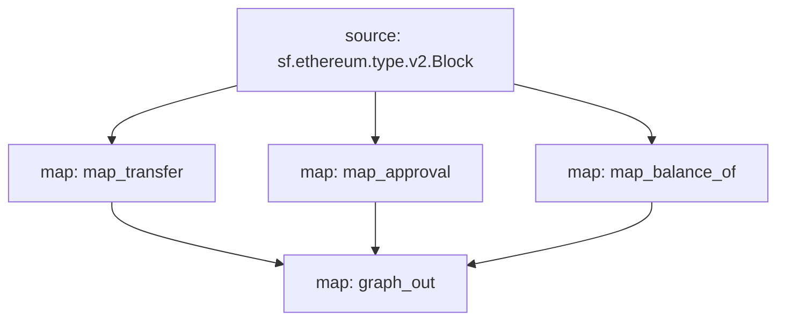

# ERC-20 Substreams

## References
- [Ethereum Docs: ERC-20 Token Standard](https://ethereum.org/en/developers/docs/standards/tokens/erc-20/)
- [EIPS: ERC-20 Token Standard ](https://eips.ethereum.org/EIPS/eip-20)
- [OpenZeppelin implementation](https://github.com/OpenZeppelin/openzeppelin-contracts/blob/9b3710465583284b8c4c5d2245749246bb2e0094/contracts/token/ERC20/ERC20.sol)
- [ConsenSys implementation](https://github.com/ConsenSys/Tokens/blob/fdf687c69d998266a95f15216b1955a4965a0a6d/contracts/eip20/EIP20.sol)

### Methods

| Method | Description |
|--------|-------------|
| [`name`](https://eips.ethereum.org/EIPS/eip-20#name) | Returns the name of the token - e.g. "MyToken".
| [`symbol`](https://eips.ethereum.org/EIPS/eip-20#symbol) | Returns the symbol of the token. E.g. "HIX". |
| [`decimals`](https://eips.ethereum.org/EIPS/eip-20#decimals) | Returns the number of decimals the token uses - e.g. `8`, means to divide the token amount by `100000000` to  |get its user representation.
| [`totalSupply`](https://eips.ethereum.org/EIPS/eip-20#totalSupply) | Returns the total token supply. |
| [`balanceOf`](https://eips.ethereum.org/EIPS/eip-20#balanceof) | Returns the account balance of another account with address `_owner`. |
| [`transfer`](https://eips.ethereum.org/EIPS/eip-20#transfer) | Transfers _value amount of tokens to address `_to`, and MUST fire the `Transfer` event. |
| [`transferFrom`](https://eips.ethereum.org/EIPS/eip-20#transferFrom) | Transfers _value amount of tokens from address `_from` to address `_to`, and MUST fire the `Transfer` event. |
| [`approve`](https://eips.ethereum.org/EIPS/eip-20#approve) | Allows `_spender` to withdraw from your account multiple times, up to the `_value` amount. If this function is  |called again it overwrites the current allowance with `_value`.
| [`allowance`](https://eips.ethereum.org/EIPS/eip-20#allowance) | Returns the amount which `_spender` is still allowed to withdraw from `_owner`. |

### Inputs `ERC20`

| input         | method                               |
|---------------|--------------------------------------|
| `0xa9059cbb`  | `transfer(address,uint256)`
| `0x23b872dd`  | `transferFrom(address,address,uint256)`
| `0x095ea7b3`  | `approve(address,uint256)`

### Inputs `Tether USDT`

> https://etherscan.io/token/0xdac17f958d2ee523a2206206994597c13d831ec7#writeContract


| input         | method                               |
|---------------|--------------------------------------|
| `0xcc872b66`  | `issue(uint256)`
| `0xdb006a75`  | `redeem(uint256)`

### Inputs `Circle UDSC`

> https://etherscan.io/address/0xa0b86991c6218b36c1d19d4a2e9eb0ce3606eb48#writeProxyContract

| input         | method                               |
|---------------|--------------------------------------|
| `0x40c10f19`  | `mint(address,uint256)`
| `0x42966c68`  | `burn(uint256)`
| `0xf2fde38b`  | `transferOwnership(address)`

### Events

| Event  | Description |
|--------|-------------|
| [`Transfer`](https://eips.ethereum.org/EIPS/eip-20#transfer-1) | MUST trigger when tokens are transferred, including zero value transfers. |
| [`Approval`](https://eips.ethereum.org/EIPS/eip-20#approval) | MUST trigger on any successful call to `approve(address _spender, uint256 _value)`. |

### Mermaid Graph





Here is a quick link to see the graph:

https://mermaid.live/edit#pako:eJyskU1qwzAQRq9iZu2Y0O7UXckN2l1kzFQex6HWD-OZQAi5e8EhEiFtV17q4_EeaC7gYk9g4MCYxupz92ZDVXlMnTCGeSDee0zmYWkXZh4akpGY1DdyTtScXpr3Kbrv_RyVHZm_ibbabKxut6_04M1pTInjCaeSvi9rp-_enP7CCYOjLg4lXra188W8iJcbdFHl1s7P9ukoRZOhp9_7jynh3ymowRN7PPZg4GJBRvJkwVjoaUCdxMIVakCV-HEODoywUg2aehTaHfHA6G_j9ScAAP__NE_Ymg

### Modules

```yaml
Name: map_transfer
Initial block: 0
Kind: map
Output Type: proto:erc20.types.v1.TransferEvents
Hash: 854cc4afbca7484fab18e3dd20bc65a399114564

Name: map_approval
Initial block: 0
Kind: map
Output Type: proto:erc20.types.v1.ApprovalEvents
Hash: 8950dc438ba0ccab94942ccf27219911486b68f7

Name: map_balance_of
Initial block: 0
Kind: map
Output Type: proto:erc20.types.v1.BalanceOfStorageChanges
Hash: a1e4cdd6b1b46ebcaf9a0e03069cdbfa8a140de9

Name: graph_out
Initial block: 0
Kind: map
Output Type: proto:substreams.entity.v1.EntityChanges
Hash: 0518343dd8ef9203d759be7f0ce1ac44d38d0d57
```